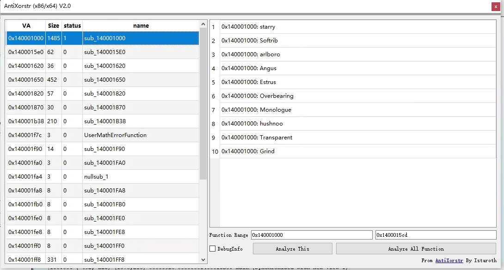
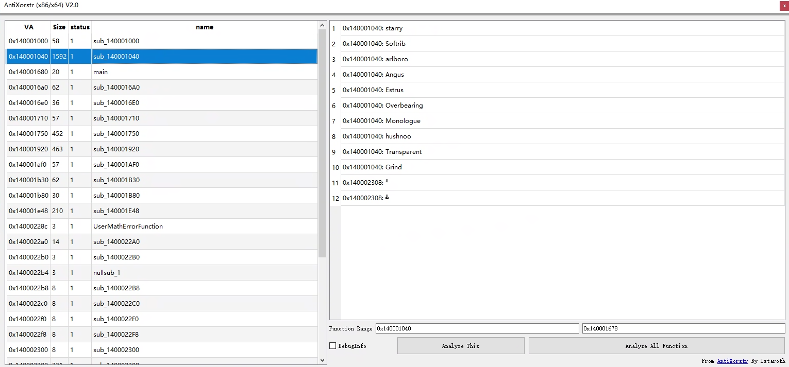

<h1 align="center">
<span>AntiXorstr</span>
</h1>
<p align="center">
    English | <a href="./README-CN.md">中文介绍</a>
</p>
<p align="center">
    <em>Enumerate and automatically decrypt encrypted strings implemented using C++ template techniques</em><br>
    <em>without concerning about the algorithmic implementation of the encrypted strings.</em>
</p>

### Principle

The compile-time encryption of strings using C++ template techniques has inherent patterns that are difficult to bypass and can be captured by specific rules. This plugin first identifies this feature, filters out suspicious features, and then uses Unicorn to simulate execution. The original decryption code is used to restore the encrypted string, so there is no need to worry about the design of the encryption algorithm.

### Installation

AntiXorstr supports x86 and x64 binary files and can run on any version of IDA >= 7.0. To install the plugin, simply copy the latest version of the code into the `plugins\` folder of your IDA installation directory. Remember to install Python 3.9 (tested) and the libraries specified in the `requirements` file.

### Examples

```c++
void SampleEncryped()
{
    std::cout << OBFUSCATED("starry") << std::endl;
    std::cout << OBFUSCATED("Softrib") << std::endl;
    std::cout << OBFUSCATED("arlboro") << std::endl;
    std::cout << OBFUSCATED("Angus") << std::endl;
    std::cout << OBFUSCATED("Estrus") << std::endl;
    std::cout << OBFUSCATED("Overbearing") << std::endl;
    std::cout << OBFUSCATED("Monologue") << std::endl;
    std::cout << OBFUSCATED("hushnoo") << std::endl;
    std::cout << OBFUSCATED("Transparent") << std::endl;
    std::cout << OBFUSCATED("Grind") << std::endl;
}
```

1. Using compile-time string encryption from [andrivet/ADVobfuscator](https://github.com/andrivet/ADVobfuscator)

   

2. Using compile-time string encryption from [JustasMasiulis/xorstr](https://github.com/JustasMasiulis/xorstr)

   

### Note

This plugin is unable to recognize programs that have been protected by techniques like VMP. Please ensure that the functions you wish to analyze have not been obfuscated.

### Todo (Unsorted)

- Shellcode support
- Improved recognition capabilities
- Support for more architectures
- Code optimization

### Thanks

[erocarrera/pefile](https://github.com/erocarrera/pefile)

[unicorn-engine/unicorn](https://github.com/unicorn-engine/unicorn)

[andrivet/ADVobfuscator](https://github.com/andrivet/ADVobfuscator)

[JustasMasiulis/xorstr](https://github.com/JustasMasiulis/xorstr)
